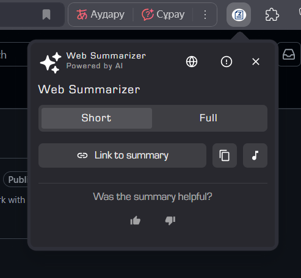

# Ziat300 – Chrome (browser) Extension for Summarizing Web Pages in Kazakh and Multiple Languages



Ziat300 is a Chrome extension that summarizes the content of web pages in Kazakh, English, or other supported languages. Powered by artificial intelligence Gemini, it reads the content of any web page and generates either a short or full summary in the selected language.

## 📦 Overview

This Chrome extension allows users to take the content of the currently open web page and summarize it in Kazakh or English. The extension analyzes the content using AI and generates a short or full summary in the selected language. The summary is displayed in a popup window in Chrome.

**It also features Text-to-Speech (TTS) functionality, allowing users to listen to the generated summary in their chosen language.**

## 💻 Technologies Used

- HTML
- CSS
- JavaScript
- Chrome Extension API
- **Web Speech API (for Text-to-Speech functionality)**

## 🚀 Installation Guide

1. Clone the repository to your computer:
   ```bash
   git clone https://github.com/dauitsuragan002/ziat300.git
   ```

2. Open Google Chrome and go to `chrome://extensions/`

3. Enable "Developer mode" in the top right corner

4. Click the "Load unpacked" button

5. Select the folder you just downloaded

6. The extension is now installed!

## 🖱️ Usage

1. Go to the web page you want to summarize
2. Click the Ziat300 icon in the top right corner of Chrome
3. Choose "Short" or "Full" summary
4. Wait for the summary to be generated
5. Read, listen to, or copy the summary
6. Switch language at any time using the globe icon

## ⚙️ Additional Features

- **Read aloud (TTS)**: Listen to the summary in the selected language using Text-to-Speech technology
- **Copy**: Copy the summary
- **Feedback**: Leave feedback about the summary quality
- **Refresh**: Regenerate the summary
- **Time**: See when the summary was generated
- **Localization**: All features and UI are available in both Kazakh and English
- 

## 🙏 Acknowledgements

- [Gemini AI](https://ai.google.dev/gemini-api/docs/quickstart) – This extension uses the Gemini API for advanced text and video summarization and transcription. See the official documentation for more details.
- [Chrome Extension Developer Documentation](https://developer.chrome.com/docs/extensions/mv3/getstarted/) – for guidance on building Chrome extensions
- https://t.me/al1xan – Developed the frontend of the site
- Dake – General contributions


